## Project Overview

This project is __ETL solution__ that utilizes the capabilities of __Java Spring Batch__ - processing framework designed for efficient jobs execution. This framework provides important features for processing large volumes of records.

The architecture of my project follows the traditional batch architecture. Each job consists of several stages, each stage involves reading data, processing it, and writing it.

The __ETL solution__ I created is essentially a Data Pipeline. It extracts data from various source systems ("__read__" operation), transforms it to meet operational needs ("__processor__" operation), and loads the transformed data into the target database ("__write__" operation).

By ensuring that data is clean, up-to-date and ready for analysis, this __ETL solution__ aids data-driven decision making, which is important in today's data oriented world. __Spring Batch-based ETL solution__ is not just a batch processing system, but a comprehensive Data Pipeline.

## Prerequisites

Required components to be installed: __Intelij IDEA__, __Postman__, __PostgreSQL__, __DBeaver__ or __PGadmin__

## Installation & Running

- Clone the repository
```
git clone https://github.com/mrfurrypants/Spring_Batch_ETL
```

- Go to __File__ - __Project Structure__ and ensure that __Java__ of version 17 is set up

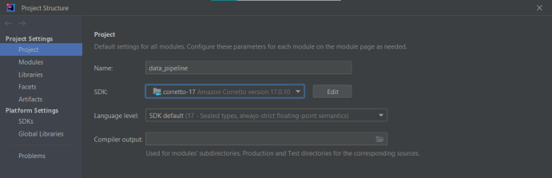

- Navigate "__application.properties__" file and specify your configuration for __PostgreSQL__ connection

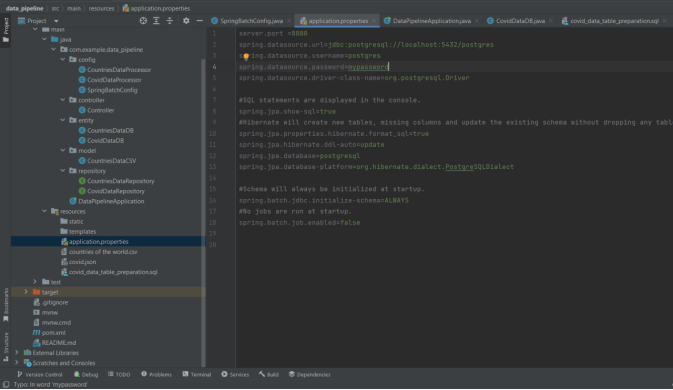

- Navigate __DataPipelineApplication__ class and launch the application

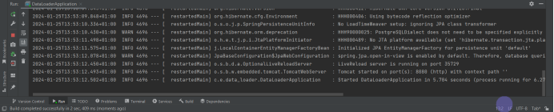

- After app is launched, in __BDeaver__ / __PGadmin__ you can see that new empty tables are already created

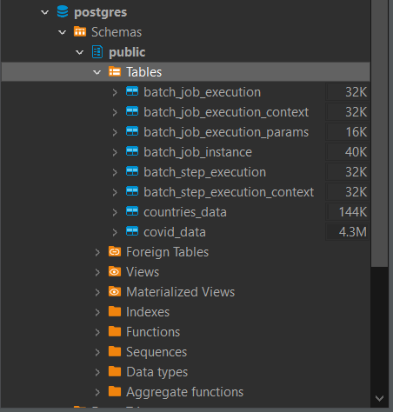

- Before start the app, navigate “resource” folder and open “__covid_data_table_preparation.sql__” script

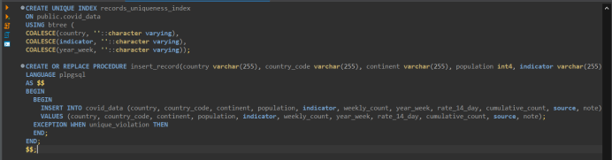

Execute these statements. The first one is used to create unique indexes to ensure that there are no duplicate values while writing updated JSON file. The second one is to create stored procedure which is executed by Spring Batch job.

- Go to Postman and create POST requests to the endpoint: http://localhost:8080/pipeline

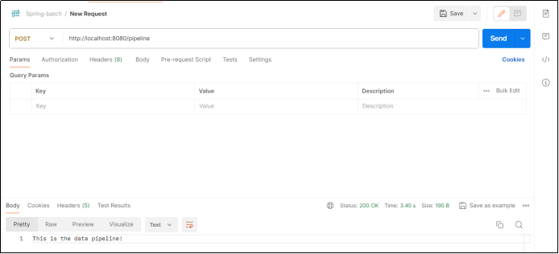

In Intelij IDEA you can observe logs of app execution.

JSON file automatically fetched from https://opendata.ecdc.europa.eu/covid19/nationalcasedeath/json/ was succesfully written to DB for __2s 266ms__.

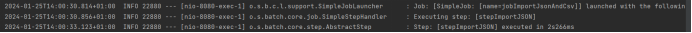

CSV file manually downloaded from https://www.kaggle.com/datasets/fernandol/countries-of-the-world/data to “__resources__” folder was succesfully written to DB for __538ms__.

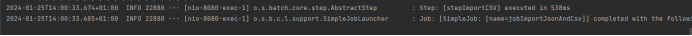

- The data from both __CSV__ and __JSON__ is stored!

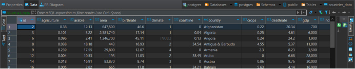

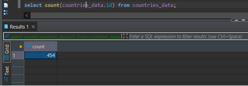

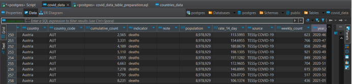

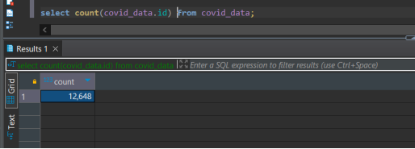

- Now let's imagine a situation when new objects were added to our __JSON__ file and the request was sent the next day. To demonstrate how the mechanism of checking the uniqueness of new objects works, I will change the mechanism of reading files to reading from local memory and add two new objects - the first is a duplicate of an existing object, the second is a new unique object.

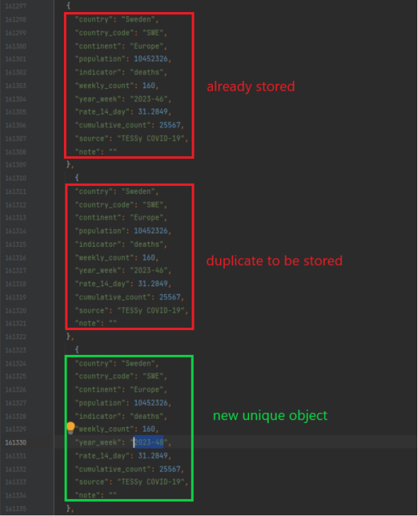

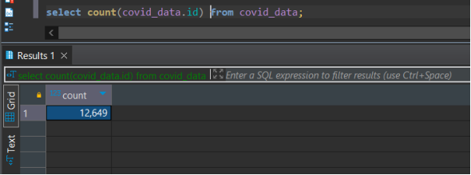

Was - __12648__, now - __12649__ - duplicated object wasn’t read.

Thank you, for your attention!